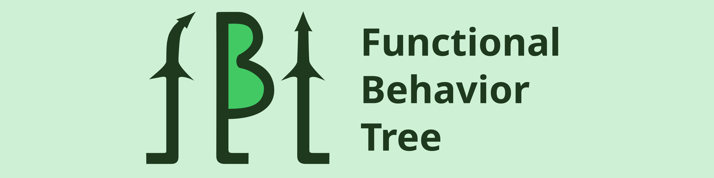
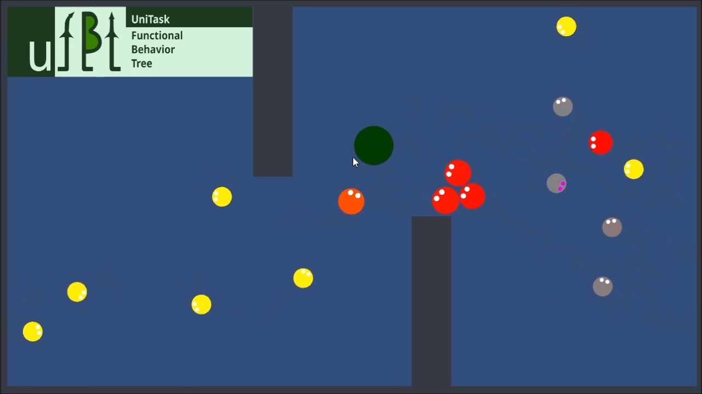

  
      VS   
  

# Unity Functional Behavior Tree Examples (FBT & uFBT)

This Unity project contains examples of using [**Functional Behavior Tree (FBT)**](https://github.com/dmitrybaltin/FunctionalBT) and [**UniTask Functional Behavior Tree (uFBT)**](https://github.com/dmitrybaltin/UnitaskFBT).

## Contents
- **Example FBT 1**: Simple AI bot using FBT.  
  Path: `Assets/Examples/FbtExample/example1/...`  
- **Example uFBT 1**: Extended bot AI with an async attack action (uFBT).  
  Path: `Assets/Examples/uFbtExample/example1/...`  
- **Example uFBT 2**: Bot AI with raycasts for target detection.  
  Path: `Assets/Examples/uFbtExample/examples/...`  

## Requirements
Developed with Unity 2022, but the libraries (FBT and uFBT) are also compatible with Unity 2021.  
If you need to use an earlier version, let me know.

## Notes
FBT provides a compact and effective syntax to build behavior trees.  
uFBT extends this with async support via UniTask.

---
